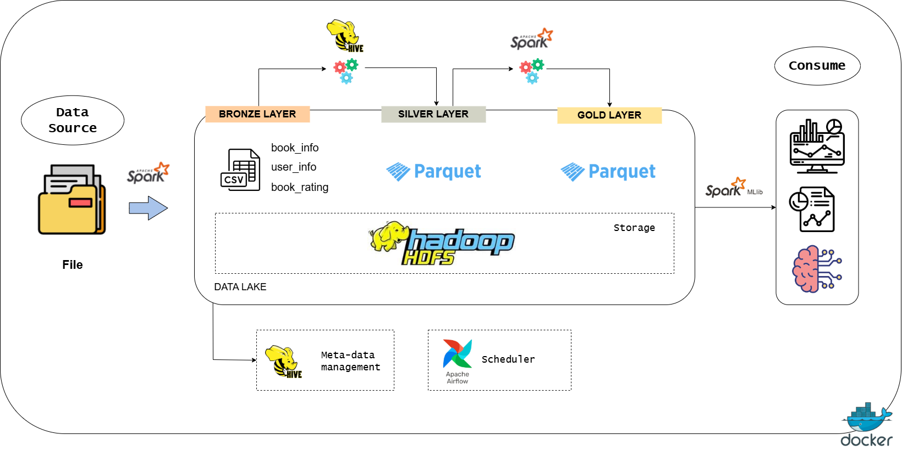

# 📚 Book Recommendation System Using Data Lake Architecture

This project presents a scalable book recommendation system built upon a big data processing pipeline using the Medallion architecture (Bronze–Silver–Gold). It utilizes Apache Spark for ETL and model training, Hadoop HDFS for data lake storage, Apache MLlib for collaborative filtering, and Apache Airflow for workflow orchestration. The final results are visualized through interactive dashboards powered by Apache Superset. This system is designed to demonstrate practical implementation of large-scale data engineering and machine learning workflows using open-source tools.

## 📘 Project Overview

This repository presents an end-to-end implementation of a Book Recommendation System built upon a modern Data Lakehouse architecture. It showcases practical application of data engineering principles, machine learning workflows, and visualization—all orchestrated in a modular and reproducible pipeline.

🔍 **Key Components Included**:

- Data Lake Design 
  Implements the **Medallion Architecture** (Bronze → Silver → Gold) to structure raw, cleaned, and enriched datasets.

- Data Engineering Workflows
  Ingests and processes data using Apache Spark, transforming source CSVs into efficient analytical formats (Parquet/ORC).

- Machine Learning Pipeline
  Builds a **Collaborative Filtering** model (ALS) to generate personalized book recommendations.

- Data Modeling & Storage 
  Incorporates structured table definitions via Hive for easier querying and integration with BI tools.

- Visualization & Insights
  Presents top-N recommendations using Apache Superset dashboards or via programmatic reporting.

---

## 🎓 Who is This Project For?

This project is a great fit for:

- **Aspiring Data Engineers** — to demonstrate Spark-based ETL pipelines and orchestration
- **Data Analysts** — to explore SQL-driven reporting and dashboard creation
- **ETL Developers** — interested in building pipelines using PySpark and Hive
- **Students & Educators** — looking for a practical, hands-on case study in big data systems
- **Portfolio Builders** — needing a well-documented project that shows technical depth

---
## 🛠️ Tech Stack

| 🛠️ Tools            | 📂 Kategori          | 🧩 Fungsi                                                                 |
|----------------------|----------------------|--------------------------------------------------------------------------|
| **HDFS**  | Storage              | Menyimpan file mentah (CSV), data terproses (Parquet/ORC)                |
| **Apache Spark**     | Processing Engine    | ETL, cleaning, join, feature engineering, dan training model ALS         |
| **Apache Hive**          | Query Engine / Metadata   | Mendefinisikan tabel eksternal untuk mengakses data pada Gold layer                 |
| **Spark MLlib**      | Machine Learning     | Membangun model rekomendasi berbasis Collaborative Filtering (ALS)      |
| **Apache Airflow**    | Workflow Orchestration   | Menjadwalkan dan mengotomatisasi proses ETL      |
| **Apache Superset**  | Visualization / BI   | Membuat dashboard rekomendasi & analisis visual                          |
| **Apache Ambari** | Cluster Management | Monitoring dan manajemen cluster Hadoop dan komponennya secara visual.             |


## Data Lake Architecture



## 
- Bronze: raw CSV files in HDFS

- Silver: cleaned & joined data in Parquet

- Gold: model output (Top-N recommendations) in ORC/Parquet


## Struktur Folder

```
book-recommendation-system/
├── README.md
├── books_data/
│   ├── books.csv
│   ├── users.csv
│   └── ratings.csv
├── Docs/
│   └── data lake architecture.png
|   └── README.md
|
├── src/
│   ├── ingest.sh   
│   ├── etl_spark.py
│   ├── train_model.py
│   ├── evaluate_model.py
│   └── generate_recommendation.py
│   └── airflow_dag.py
├── docker-compose.yml
└── requirements.txt
```
## Authors

- Mayada (121450145)
- Natasya Ega Lina Marbun (122450024)
- Syalaisha Andini Putriansyah (22450111)
- Anwar Muslim (122450117)


